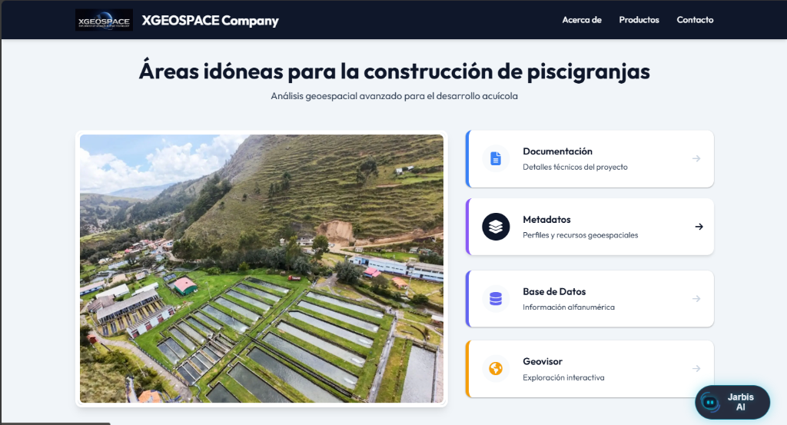
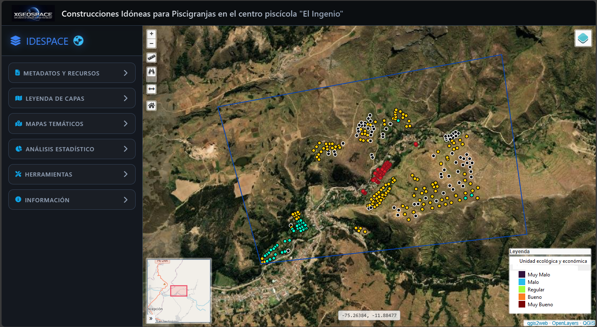

<div align="center">

  

  <br />
  <br />

  # 🌍 XGEOSPACE Platform
  ### Determinar las áreas idóneas para la construcción de piscigranjas en el centro Piscícola Ingenio de la provincia de Huancayo

  [](https://github.com/tu-usuario/xgeospace)
  [](https://github.com/tu-usuario/xgeospace)
  [](https://xgeospace.web.app/)
  [](LICENSE)

  <br />

  <p align="center">
    <strong>XGEOSPACE</strong> revoluciona la identificación de zonas aptas para piscigranjas en el Perú mediante el uso de <b>Teledetección</b>, <b>GIS</b> e <b>Inteligencia Artificial</b>.
    <br />
    <a href="#-características">Explorar</a>
    ·
    <a href="#-tecnologías">Tecnologías</a>
    ·
    <a href="#-demo">Ver Demo</a>
    ·
    <a href="#-contacto">Contacto</a>
  </p>
</div>

---

## 📖 Sobre el Proyecto

**XGEOSPACE** es una plataforma integral diseñada para modernizar el Centro Piscícola de Ingenio. A través de un análisis multicriterio y procesamiento de imágenes satelitales, proporcionamos herramientas precisas para la expansión acuícola.

> *"Nuestra misión es transformar datos complejos en decisiones estratégicas simples y efectivas para el desarrollo sostenible."*

## 🚀 Características

| 🛰️ **Análisis Satelital** | 🗺️ **Geovisores Interactivos** |
|:-------------------------|:-----------------------------|
| Procesamiento de imágenes Sentinel-2 y Landsat. Cálculo automático de índices espectrales (**NDVI**, **NDMI**, **SAVI**) para monitoreo ambiental. | Exploración dinámica de capas geográficas, catastros y zonificación ecológica económica (ZEE) en tiempo real. |

| 📊 **Dashboards & Data** | 🤖 **Jarbis AI Assistant** |
|:------------------------|:--------------------------|
| Visualización estadística avanzada con **R** y **Shiny**. Métricas claras para la toma de decisiones gerenciales. | Asistente virtual integrado entrenado para responder consultas técnicas y guiar al usuario en la plataforma. |

## 🛠️ Tecnologías

El núcleo de XGEOSPACE está construido sobre un stack robusto y moderno:

<div align="center">

| Frontend | Geospatial / Backend | Diseño & UI |
|:--------:|:--------------------:|:-----------:|
|  |  |  |
|  |  |  |
|  |  |  |

</div>

## 📂 Estructura del Repositorio

```bash
XGEOSPACE/
├── 📄 index.html           # Landing Page (Punto de entrada)
├── 📄 dashboard_piscigranjas.html # Tablero de control principal
├── 📂 css/                 # Estilos y Diseño (Glassmorphism)
├── 📂 js/                  # Lógica del Sistema y Jarbis AI
│   ├── script.js           # Core functions
│   └── chatbot_data.js     # Base de conocimiento AI
├── 📂 img/                 # Assets gráficos
└── 📄 README.md            # Documentación del proyecto
```

## 📸 Galería

<div align="center">
  <table>
    <tr>
      <td align="center"><strong>Geovisor Final</strong></td>
      <td align="center"><strong>Metadatos & Análisis</strong></td>
    </tr>
    <tr>
      <td></td>
      <td></td>
    </tr>
  </table>
</div>

## 👨‍💻 Autor y Contacto

<div align="center">
  
  **Geom. Felix Aldimar Aiquipa Gonzales**  
  *Director de Proyectos & Desarrollador Principal*

  <a href="https://www.linkedin.com/in/felix-aiquipa-gonzales">
    
  </a>
  <a href="mailto:aiquipafelix@gmail.com">
    
  </a>
  <a href="https://wa.me/51904013678">
    
  </a>

</div>

---

<div align="center">
  <p>© 2025 XGEOSPACE | Todos los derechos reservados</p>
  <p><i>Innovación Geoespacial al servicio del Perú 🇵🇪</i></p>
</div>
